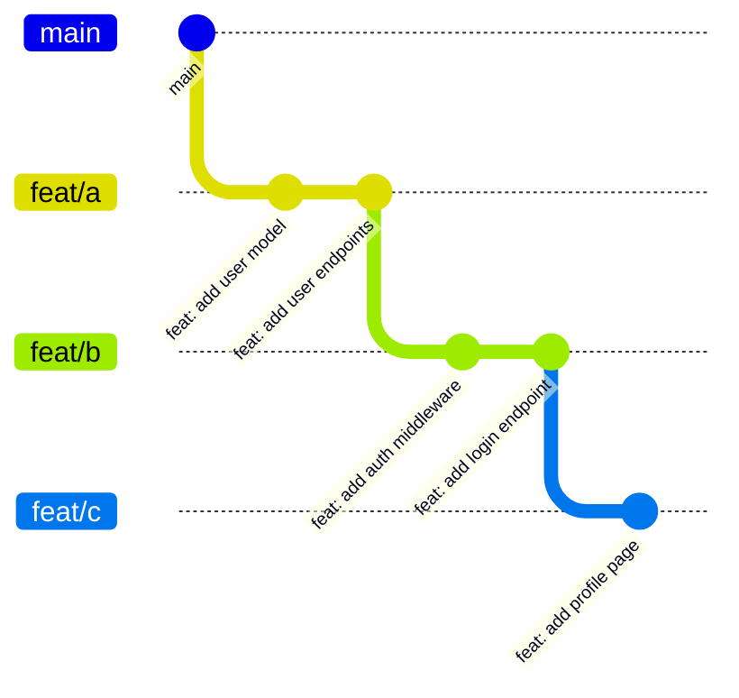

import Alert from '~/components/alert.astro'

Under trunk-based development, long-lived feature branches are friction. A PR with 600 changed lines is painful to review—your reviewer either rubber-stamps it or spends an afternoon on it. Three PRs of 200 lines each are manageable, can be reviewed in parallel, and can land independently without a pile of merge conflicts waiting at the end. Stacked branches are how you keep building while earlier work waits for review: each branch builds on the one before it, each gets its own PR, and you move forward without blocking on anyone.

The setup is straightforward. The catch shows up the moment someone merges one of your branches.

## What a Stack Looks Like

Say you are working on a feature that touches the data model, the API layer, and the frontend. Instead of one massive branch, you build three:



`feat/b` branches off `feat/a`, not off `main`. It depends on the work in `feat/a`. `feat/c` depends on `feat/b`. Each is its own PR, each gets reviewed on its own terms. When `feat/a` lands, you rebase `feat/b` onto `main`, open a new review, and keep going.

## Rebasing the Whole Stack

When `main` moves forward—a teammate lands something while you are mid-stack—you want to rebase your entire stack in one shot. With `rebase.updateRefs true`, a single rebase from the bottom branch updates all the branches above it automatically:

```bash
git config --global rebase.updateRefs true

# on feat/a, with the full stack above it
git rebase main
```

Git replays `feat/a` onto the new `main` tip, then automatically force-updates `feat/b` and `feat/c` to point at the rebased commits. Without this config, you would rebase `feat/a`, switch to `feat/b`, rebase that, switch to `feat/c`, rebase that—three commands, three chances to get the branch names wrong.

## The Squash Merge Problem

Most teams use squash merge. When `feat/a`'s PR is approved and merged, GitHub or GitLab collapses all the commits in `feat/a` into one brand new commit on `main`. That new commit has a brand new SHA. Your local `feat/a` commits still exist with their original SHAs.

As far as git is concerned, those two sets of commits are completely unrelated objects. They represent the same changes to the same files, but they have different hashes, different parents, different everything.

Now you try to rebase `feat/b` onto `main`:

```bash
git rebase main feat/b
```

Git tries to replay all of `feat/b`'s history onto `main`—including the commits that came from `feat/a`. Those commits are already represented by the squash commit, but git does not know that. What you get is conflicts on changes that are already merged, or duplicate changes applied on top of themselves, or both at once.

Your local commits and the squash commit contain the same changes. Git sees two completely different objects and tries to apply them both.

## git rebase --onto to the Rescue

The three-argument form of `--onto` is exactly what you need:

```bash
git rebase --onto main feat/a feat/b
```

Read it as: take the commits reachable from `feat/b` that are NOT reachable from `feat/a`, and replay them onto `main`. By naming `feat/a` as the upstream, you are telling git to exclude everything that was already in `feat/a`—which is exactly the already-merged work. The only commits that get replayed are the ones that belong to `feat/b` itself.

No interactive editing. No manually identifying and dropping commits one by one. Just the clean commits from `feat/b` land on `main`.

Then clean up the merged branch:

```bash
git branch -D feat/a
```

If you have `feat/c` stacked above `feat/b`, you repeat the pattern:

```bash
git rebase --onto main feat/b feat/c
```

Each command names the branch that was just handled as the upstream, excluding those commits from the replay.

## The Interactive Alternative (and Why It Hurts)

Before `--onto`, the common answer was `git rebase -i main`. That drops you into a todo file listing every commit reachable from `feat/b` that is not on `main`—which includes all the `feat/a` commits you need to drop. You scroll through, find them, delete those lines, save, and let it run.

With two or three commits in the merged branch it is tolerable. With eight commits across two merged branches, you are reading SHA prefixes and commit messages, trying not to accidentally delete the wrong line. `--onto` scales with your stack depth. `-i` does not.

That said, interactive rebase is still the right tool for reshaping a single branch—squashing fixup commits, reordering things, rewriting messages. So it is worth knowing how to drive it when you land there.

When git opens the interactive rebase todo list, it uses the editor resolved from `core.editor`, then `GIT_EDITOR`, then `VISUAL`, then `EDITOR`, falling back to `vi` if none of those are set. That last fallback is why so many people end up in vim without ever choosing it.

The thing that trips people up is the mental model. Vim starts in normal mode, and the rebase todo list is a normal-mode job. You do not need insert mode to edit it.

- `dd` deletes the line under the cursor. That is how you drop a commit from the todo.
- `cw` changes the current word—how you change `pick` to `squash`, `fixup`, or `reword`. This is the one moment you land in insert mode; `Esc` gets you back out.
- `:wq` saves the file and starts the rebase. `:q!` aborts it entirely. Both are typed from normal mode.
- If you pressed `i` at some point, hit `Esc` before typing `:wq`, or those characters will land in the file instead of the command line.

<Alert variant="info">
Two configs worth adding if you are going to use interactive rebase at all:

```bash
# Stop git from silently dropping commits you accidentally deleted
git config --global rebase.missingCommitsCheck error

# Or redirect just the rebase todo list to a GUI editor while keeping vim for commit messages
git config --global sequence.editor "cursor --wait"
```

`rebase.missingCommitsCheck error` makes git bail out rather than silently proceed if you accidentally deleted a commit line from the todo. It pairs directly with how easy `dd` makes it to remove a line you did not mean to. `sequence.editor` overrides the editor for the rebase todo specifically, leaving `core.editor` intact for commit messages. `code --wait` works just as well if VS Code is your editor.
</Alert>

Squash merges and stacked branches work fine together—you just need the right tool. `git rebase --onto` gives you a precise, repeatable way to clean up the stack after each merge without the fragile manual work of `-i`.

For the force-push safety flags that go with all of this, see [part 1](/blog/git-rebase-great-power).

## References

- [git-rebase documentation](https://git-scm.com/docs/git-rebase)
- [Trunk Based Development](https://trunkbaseddevelopment.com)
- [Stacked Pull Requests](https://graphite.dev/guides/stacked-prs)
