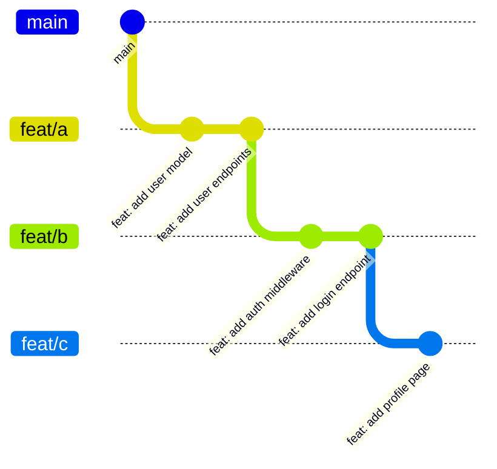

import Alert from '~/components/alert.astro'

Large PRs are hard to review. There's a certain irony to it: send someone a 600-line PR and you'll get a rubber-stamp LGTM; send them 150 lines and suddenly there are comments on every function. With agentic coding, PRs are only getting bigger—some teams now use agents to review them, which feels like the logical conclusion of something. I'm not here to take a position on any of that. Being able to break work into smaller chunks is still worth doing, and stacked branches are the cleanest way I know how: each branch builds on the one before it, each gets its own PR, and you keep moving without blocking on anyone.

The setup is straightforward. The catch shows up the moment someone merges one of your branches.

## What a Stack Looks Like

Say you have a chunk of work large enough to split up—one feature or a few related streams. You build a stack of branches, each one branching off the last:



`feat/b` branches off `feat/a`, not off `main`. It depends on the work in `feat/a`. `feat/c` depends on `feat/b`. Each is its own PR, each gets reviewed on its own terms. When `feat/a` lands, you rebase `feat/b` onto `main`, open a new review, and keep going.

## Rebasing the Whole Stack

When `main` moves forward—a teammate lands something while you are mid-stack—you want to rebase your entire stack in one shot. With `rebase.updateRefs true`, a single rebase from the bottom branch updates all the branches above it automatically:

```bash
git config --global rebase.updateRefs true

# on feat/a, with the full stack above it
git rebase main
```

Git replays `feat/a` onto the new `main` tip, then automatically force-updates `feat/b` and `feat/c` to point at the rebased commits. Without this config, you would rebase `feat/a`, switch to `feat/b`, rebase that, switch to `feat/c`, rebase that—three commands, three chances to get the branch names wrong.

One thing worth knowing: if rebasing `feat/a` onto `main` produces conflicts, git pauses for you to resolve them before continuing. Once `feat/a`'s rebase completes, git moves `feat/b`—and if that produces conflicts, git pauses again. Each branch's conflicts surface and get resolved in order. It's still less work than rebasing each branch individually.

## The Squash Merge Problem

If you prefer a linear history—and I do—you probably enforce squash merges on your PRs. When `feat/a`'s PR is approved and merged, GitHub or GitLab collapses all the commits in `feat/a` into one brand new commit on `main`. That new commit has a brand new SHA. Your local `feat/a` commits still exist with their original SHAs.

As far as git is concerned, those two sets of commits are completely unrelated objects. They represent the same changes to the same files, but they have different hashes, different parents, different everything.

Now you try to rebase `feat/b` onto `main`:

```bash
git rebase main feat/b
```

Git tries to replay all of `feat/b`'s history onto `main`—including the commits that came from `feat/a`. Those commits are already represented by the squash commit, but git does not know that. What you get is conflicts on changes that are already merged, or duplicate changes applied on top of themselves, or both at once.

Your local commits and the squash commit contain the same changes. Git sees two completely different objects and tries to apply them both.

## git rebase --onto to the Rescue

The three-argument form of `--onto` is exactly what you need:

```bash
git rebase --onto main feat/a feat/b
```

Read it as: take the commits reachable from `feat/b` that are NOT reachable from `feat/a`, and replay them onto `main`. By naming `feat/a` as the upstream, you are telling git to exclude everything that was already in `feat/a`—which is exactly the already-merged work. The only commits that get replayed are the ones that belong to `feat/b` itself.

No interactive editing. No manually identifying and dropping commits one by one. Just the clean commits from `feat/b` land on `main`.

Then clean up the merged branch:

```bash
git branch -D feat/a
```

If you have `feat/c` stacked above `feat/b`, you repeat the pattern:

```bash
git rebase --onto main feat/b feat/c
```

Each command names the branch that was just handled as the upstream, excluding those commits from the replay.

## What I Was Doing Before

The alternative people reach for is `git rebase -i main`. That drops you into an interactive todo file listing every commit reachable from `feat/b` that isn't on `main`—including all the `feat/a` commits you need to drop. So I'd scroll through, find each one, mark it `d` to drop it, save, and move on. With two commits it's fine. With eight commits across two merged branches you're squinting at SHA prefixes trying not to drop the wrong line. I've been doing this for longer than I'd like to admit. `--onto` is the flag I wish I'd known sooner.

Squash merges and stacked branches work fine together—you just need the right tool. `git rebase --onto` gives you a precise, repeatable way to clean up the stack after each merge without the fragile manual work of `-i`.

For the force-push safety flags that go with all of this, see [part 1](/blog/git-rebase-great-power).

## References

- [git-rebase documentation](https://git-scm.com/docs/git-rebase)
- [Trunk Based Development](https://trunkbaseddevelopment.com)
- [Stacked Pull Requests](https://graphite.dev/guides/stacked-prs)
